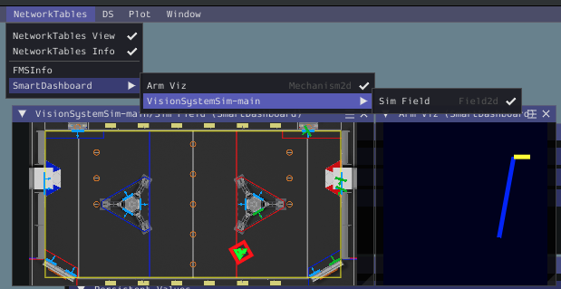
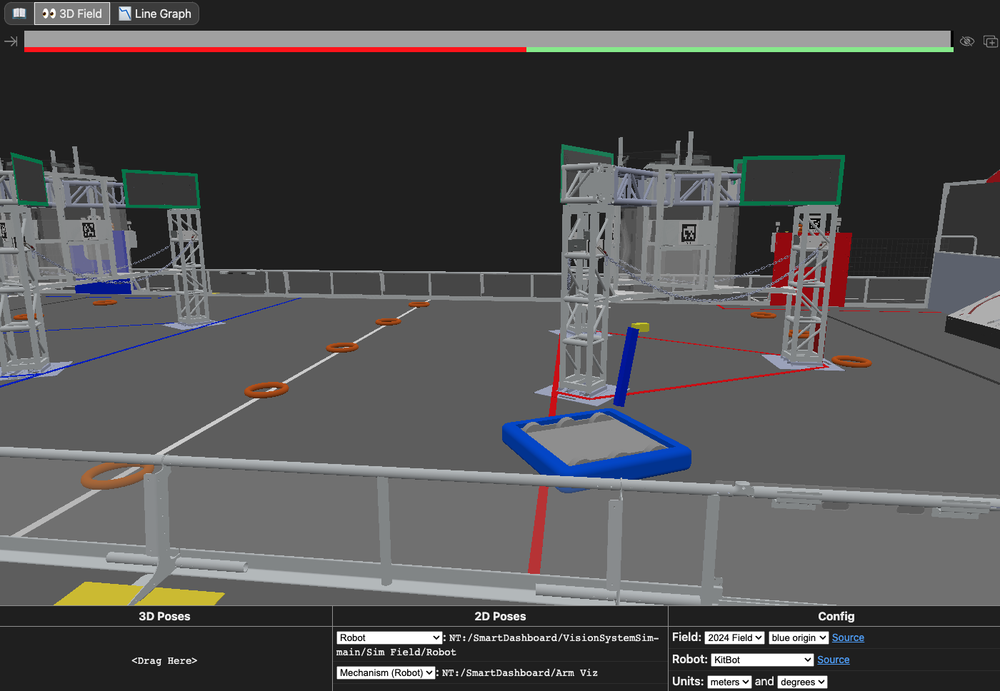
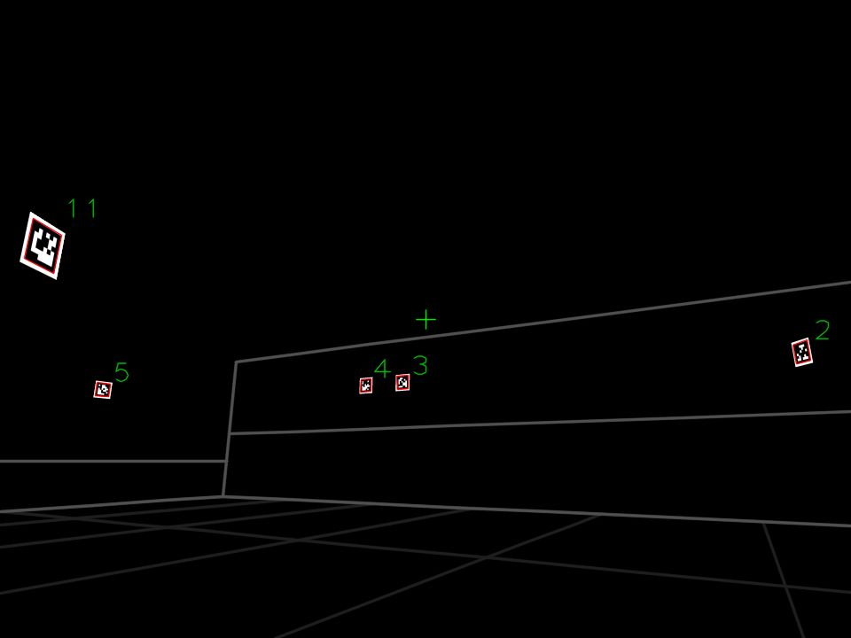

# 3847 2024 - Simulation and Prep Code

Uses 604's Simulation Example as a base and brings in our 2024 SpectrumLib with updates

## Key Elements

* Multi-Folder Organization
  * Makes it easy to divide up work between multiple programmers and isolate changes.
  * Simplifies pull requests as main files (robot.java, etc) don't get modified as often
* Mechanism Library Class
  * Wraps most of the TalonFX calls in easier to use fuctions
  * Makes it easy to configure a TalonFX for each mechanism
  * Allows you to configure mechanism for each robot
  * allows you to only configure motors if the mechanism is "Attached" this way you can run on different robots
* Pilot Class
  * Only configures triggers once the controller is connected
  * Wraps all the gamepad/xbox controls
  * Makes it easier to have modifier buttons (like LeftBumper+x does something else for x alone)
* Simulation Templates
  * RollerSim, LinearSim, and ArmSim allows you to easily add simulation support to all mechanisms
* SpectrumLib.Util.TuneValue
  * Makes it simple to setup a value on the smartdashboard to return a value to a caommand and tune it.

- [CTRE swerve](src/main/java/frc/robot/subsystems/CommandSwerveDrivetrain.java)- Simulation built in

  - Added Configuration options to so it can run on multiple robots and set different encoder offsets and other configs
- [PhotonVision sim](src/main/java/frc/robot/subsystems/VisionSystem.java)

  - Updated based on the CTRE swerve sim pose
  - Visualized using the built in Field2d widget & web GUI
- [AdvantageScope](https://github.com/Mechanical-Advantage/AdvantageScope) for 3d viz and plotting

  - Basic layout [provided](advantagescope_layout.json)

## Additional Resources

- [WPILib simulation](https://docs.wpilib.org/en/stable/docs/software/wpilib-tools/robot-simulation/index.html)
- [WPILib physics simulation](https://docs.wpilib.org/en/stable/docs/software/wpilib-tools/robot-simulation/physics-sim.html)
- [PhotonVision simulation](https://docs.photonvision.org/en/latest/docs/simulation/simulation.html)
- [Mechanism2d](https://docs.wpilib.org/en/stable/docs/software/dashboards/glass/mech2d-widget.html)
- [AdvantageScope 3D Field](https://github.com/Mechanical-Advantage/AdvantageScope/blob/main/docs/tabs/3D-FIELD.md)

## Controls

- Left stick X/Y: Swerve translate
- Tirggers: Swerve rotate

## Setup

### With just WPILib simulation GUI

- Ensure the Arm Viz and Sim Field are displayed

### With AdvantageScope

- In AdvantageScope, click `File > Import Layout` and select `advantagescope_layout.json`.
- Connect to the local simulator `File > Connect to Simulator`

### PhotonVision

- View PhotonVision camera sim at http://localhost:1182

